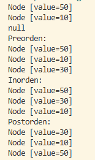
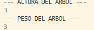
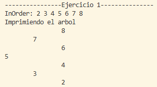
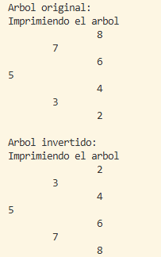

# PROYECTO: ESTRUCTURAS DE DATOS EN JAVA (ÁRBOLES BINARIOS)

**Nombre:** Daniel Flores  
**Materia:** Estructuras de Datos en Java  
**Tema:** Árboles Binarios, recorridos, altura, peso e inversión de árboles  

---

# PARTE 1: ÁRBOL BINARIO Y RECORRIDOS

## Objetivo
Implementar un árbol binario y realizar sus recorridos básicos: preorden, inorden y postorden.

## Estructura del árbol
El árbol está compuesto por nodos enlazados, donde cada nodo contiene:
- Valor
- Hijo izquierdo
- Hijo derecho

## Inserción (BST)
Los elementos se insertan siguiendo la regla del árbol binario de búsqueda:
- Valores menores → izquierda  
- Valores mayores → derecha  

## Recorridos

### Preorden
Raíz → Izquierda → Derecha  

### Inorden
Izquierda → Raíz → Derecha (devuelve ordenado en BST)

### Postorden
Izquierda → Derecha → Raíz  

## Resultado
Permite construir y recorrer correctamente un árbol binario.

# PARTE 2: ALTURA Y PESO DEL ÁRBOL

## Objetivo
Calcular propiedades estructurales del árbol.

## Altura
La altura es el nivel máximo del árbol desde la raíz hasta una hoja.

Fórmula:
altura = max(altura izquierda, altura derecha) + 1

## Peso
El peso es la cantidad total de nodos del árbol.

Fórmula:
peso = nodos izquierda + nodos derecha + 1

## Resultado
Permite analizar el tamaño y profundidad del árbol.

---

# PARTE 3: EJERCICIOS PRÁCTICOS

## Ejercicio 1: Inserción y visualización
Se insertan números en el árbol y se muestran sus recorridos.

Ejemplo:
int[] numeros = {5, 3, 7, 2, 4, 6, 8};

Se imprime:
- InOrder
- Representación visual del árbol

---

## Ejercicio 2: Inversión del árbol

## Objetivo
Invertir el árbol binario (efecto espejo).

## Lógica
Se intercambian los hijos de cada nodo:
izquierda ↔ derecha

## Ejemplo

Antes:
    5
   / \
  3   7

Después:
    5
   / \
  7   3

## Resultado
Se imprime el árbol original y el árbol invertido usando recorrido visual.

---

# CONCLUSIÓN

En este proyecto pude entender mejor cómo funcionan los árboles binarios en Java y cómo se pueden representar mediante nodos y referencias, además de practicar recorridos como preorden, inorden y postorden, lo cual me ayudó a comprender cómo se procesa la información dentro de una estructura de este tipo, también aprendí a calcular la altura y el peso del árbol lo que me permitió analizar su tamaño y complejidad de forma más clara, y finalmente con la inversión del árbol reforcé la idea de recursividad y cómo se pueden modificar estructuras completas intercambiando sus nodos, en general este proyecto me ayudó a mejorar mi lógica de programación y a entender mejor el funcionamiento interno de los árboles binarios en Java
---